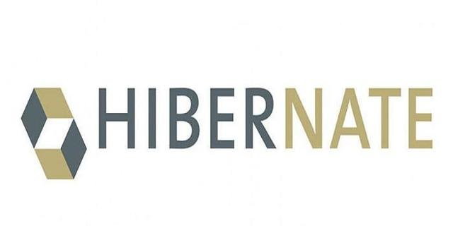

# Mybatis


# Interviewe

## 1.Mybatis有什么关键作用？

MyBatis是持久层框架，支持JDBC，简化了持久层开发。

使用MyBatis时，只需要通过接口指定数据操作的抽象方法，然后配置与之关联的SQL语句，即可。


持久化存储：在程序运行过程中，数据都是在内存（RAM，即内存条）中的，内存中的数据不是永久存储的，例如程序可以对这些数据进行销毁，或者由于断电也会导致内存中所有数据丢失！而把数据存储到硬盘中的某个文件中，会使得这些数据永久的存储下来，常见做法是存储到数据库中，当然，也可以使用其他技术把数据存储到文本文件、XML文件等其他文件中。


## 2.Mybatis和Herbanate的区别

MyBatis（前身是iBatis）是一个支持普通SQL查询、存储过程以及高级映射的持久层框架，它消除了几乎所有的JDBC代码和参数的手动设置以及对结果集的检索，并使用简单的XML或注解进行配置和原始映射，用以将接口和Java的POJO（Plain Old Java Object，普通Java对象）映射成数据库中的记录，使得Java开发人员可以使用面向对象的编程思想来操作数据库。

MyBatis 框架也被称之为 ORM（Object/Relational Mapping，即对象关系映射）框架。所谓的 ORM 就是一种为了解决面向对象与关系型数据库中数据类型不匹配的技术，它通过描述Java对象与数据库表之间的映射关系，自动将Java应用程序中的对象持久化到关系型数据库的表中。ORM框架的工作原理如下图所示。


从上图可以看出，使用ORM框架后，应用程序不再直接访问底层数据库，而是以面向对象的方式来操作持久化对象（Persisent Object，PO），而ORM框架则会通过映射关系将这些面向对象的操作转换成底层的SQL操作。

当前的ORM框架产品有很多，常见的ORM框架有Hibernate和MyBatis。这两个框架的主要区别如下。

- **Hibernate：**是一个全表映射的框架。通常开发者只需定义好持久化对象到数据库表的映射关系，就可以通过 Hibernate 提供的方法完成持久层操作。开发者并不需要熟练地掌握 SQL语句的编写，Hibernate会根据制定的存储逻辑，自动的生成对应的SQL，并调用JDBC接口来执行，所以其开发效率会高于MyBatis。然而Hibernate自身也存在着一些缺点，例如它在多表关联时，对 SQL 查询的支持较差；更新数据时，需要发送所有字段；不支持存储过程；不能通过优化 SQL 来优化性能等。这些问题导致其只适合在场景不太复杂且对性能要求不高的项目中使用。

- **MyBatis：**是一个半自动映射的框架。这里所谓的“半自动”是相对于Hibernate全表映射而言的，MyBatis 需要手动匹配提供 POJO、SQL和映射关系，而Hibernate只需提供POJO 和映射关系即可。与Hibernate相比，虽然使用MyBatis手动编写 SQL 要比使用Hibernate的工作量大，但MyBatis可以配置动态SQL并优化SQL，可以通过配置决定SQL的映射规则，它还支持存储过程等。对于一些复杂的和需要优化性能的项目来说，显然使用MyBatis更加合适。推荐了解传智播客[java](http://java.itcast.cn/)中级程序员课程。


## 3.Mybatis如何实现批量插入？ 

**之所以要批量插入是为了避免数据库和程序之间建立多次连接，增加服务器的负荷。**


### 正常的插入多条数据是这样子的:

```sql
insert into user 
		(username, `password`, age, gender)
VALUES 
		('杨豆豆','123456',11,'male'), 
		('杨豆豆1','123456',11,'male')
```


### 动态sql foreach:

```xml
<insert id="insertBatch" >
    insert into user 
    	( <include refid="Base_Column_List" /> ) 
    values 
        <foreach collection="list" item="item" index="index" separator=",">    <!--用逗号分开-->
            (#{item.username},#{item.password},#{item.age},#{item.gender})
        </foreach>
</insert>
```

参考：https://www.jianshu.com/p/97e484b55d04


## 4.Mybatis里插入一条数据，如何返回这条记录的主键?

统一都用selectKey, 只是在Oracle里面用的话，这里是返回序列号

Oracle：

```xml
<selectKey keyProperty="id" resultType="Long" order="BEFORE"> 
    SELECT SEQUENCE_1.nextval AS id FROM dual
</selectKey>
```

Mysql：

```xml
<selectKey keyProperty="id" resultType="java.lang.Integer" order="AFTER">
    SELECT LAST_INSERT_ID()
</selectKey>
```


## 5.Mybatis 十万条 数据 五万条数据更新,五万条新增 怎么去实(DUPLICATE)

在 mysql 中，当存在主键冲突或唯一键冲突的情况下，根据插入策略不同，一般有以下三种避免方法：

- `insert ignore into`：若没有则插入，若存在则忽略

- `replace into`：若没有则正常插入，若存在则先删除后插入

- `insert into ... on duplicate key update`：若没有则正常插入，若存在则更新

```sql
#数据库原来2中有数据，4中没有数据。
insert into ljtest
	(id, emp_no, title, from_date) 
values 
 	(2, 20002, 'insert test 2', '0000-00-00'), 
	(4, 40004, 'insert test 4', '0000-00-00') 
on duplicate key update emp_no=values(emp_no), title=values(title); 

#结果
Query OK, 3 rows affected (0.00 sec)
Records: 2  Duplicates: 1  Warnings: 0
```


参考：https://blog.csdn.net/lijing742180/article/details/90243470?utm_medium=distribute.pc_relevant.none-task-blog-BlogCommendFromMachineLearnPai2-3.channel_param&depth_1-utm_source=distribute.pc_relevant.none-task-blog-BlogCommendFromMachineLearnPai2-3.channel_param


## 6.Mybatis #{} 和 ${}的区别是什么?  具体#的底层是怎么样做的？为什么#{}可以防止SQL注入？Mybatis如何防注入的? PrepareStatement底层原理是怎么样的，预编译做了什么？

- `${}`是 Properties 文件中的变量占位符，它可以用于标签属性值和 sql 内部，属于静态文本替换，比如\${driver}会被静态替换为`com.mysql.jdbc.Driver`。
- `#{}`是 sql 的参数占位符，Mybatis 会将 sql 中的`#{}`替换为?号，在 sql 执行前会使用 PreparedStatement 的参数设置方法，按序给 sql 的?号占位符设置参数值，比如 ps.setInt(0, parameterValue)，`#{item.name}` 的取值方式为使用反射从参数对象中获取 item 对象的 name 属性值，相当于 `param.getItem().getName()`。


参考：JavaGuide和下面这篇文章 写的很好。

https://blog.csdn.net/yizhenn/article/details/52384601


## 7.Mybatis里Left join inner join有什么区别？他们使用之后分别是什么结果？

参考Mysql。


## 8.Mybatis中，xml和mapper接口是如何映射的?


你知道如何批量插入吗？用Mybatis-plus

Mybatis的缓存原理？

mybatis用的反射(关于mybatis的细节)

介绍逆向工程：Generator和Mybatis-Plus

项目mybatis怎么使用？用mapper映射文件还是注解?

mybatis的xml文件中有什么标签?

mybatis 逆向工程，mybatis 的批量操作，比如大批量数据更新(这个问题卡住了)：在应用里面用 mybatis 实现大批量数据(上万条)的更新，常规做法：Java 的 for 循环，慢，然后他说你可以去了解一下。


mybatis的实现过程?怎么配置的?

mybait-start，了解过他什么时候生效的吗?

JPA了解吗？知道Hibernate吗？为何选择Mybatis，它和Hibernate的区别是什么


## 9.Mybatis的常用标签

Mybatis的常用标签有哪些，如果DAO层的集合对象和<#foreache>标签名字不一样怎么解决的？(当时一时半会儿想不起来，面试官已经提示用@Param注解了，然而我听成了@Parable……)


10.Hibernate用过吗，JDBCTemplate用过吗？介绍一下里面具体的方法

11.where和where标签的区别

12.${}和#{}有什么区别


> 参考自：https://github.com/Snailclimb/JavaGuide.git

## JavaGuide

### 1、#{}和\${}的区别是什么？

注：这道题是面试官面试我同事的。

答：

- `${}`是 Properties 文件中的变量占位符，它可以用于标签属性值和 sql 内部，属于静态文本替换，比如\${driver}会被静态替换为`com.mysql.jdbc.Driver`。
- `#{}`是 sql 的参数占位符，Mybatis 会将 sql 中的`#{}`替换为?号，在 sql 执行前会使用 PreparedStatement 的参数设置方法，按序给 sql 的?号占位符设置参数值，比如 ps.setInt(0, parameterValue)，`#{item.name}` 的取值方式为使用反射从参数对象中获取 item 对象的 name 属性值，相当于 `param.getItem().getName()`。

### 2、Xml 映射文件中，除了常见的 select|insert|updae|delete 标签之外，还有哪些标签？

注：这道题是京东面试官面试我时问的。

答：还有很多其他的标签，`<resultMap>`、`<parameterMap>`、`<sql>`、`<include>`、`<selectKey>`，加上动态 sql 的 9 个标签，`trim|where|set|foreach|if|choose|when|otherwise|bind`等，其中<sql>为 sql 片段标签，通过`<include>`标签引入 sql 片段，`<selectKey>`为不支持自增的主键生成策略标签。

### 3、最佳实践中，通常一个 Xml 映射文件，都会写一个 Dao 接口与之对应，请问，这个 Dao 接口的工作原理是什么？Dao 接口里的方法，参数不同时，方法能重载吗？

注：这道题也是京东面试官面试我时问的。

答：Dao 接口，就是人们常说的 `Mapper`接口，接口的全限名，就是映射文件中的 namespace 的值，接口的方法名，就是映射文件中`MappedStatement`的 id 值，接口方法内的参数，就是传递给 sql 的参数。`Mapper`接口是没有实现类的，当调用接口方法时，接口全限名+方法名拼接字符串作为 key 值，可唯一定位一个`MappedStatement`，举例：`com.mybatis3.mappers.StudentDao.findStudentById`，可以唯一找到 namespace 为`com.mybatis3.mappers.StudentDao`下面`id = findStudentById`的`MappedStatement`。在 Mybatis 中，每一个`<select>`、`<insert>`、`<update>`、`<delete>`标签，都会被解析为一个`MappedStatement`对象。

Dao 接口里的方法，是不能重载的，因为是全限名+方法名的保存和寻找策略。

Dao 接口的工作原理是 JDK 动态代理，Mybatis 运行时会使用 JDK 动态代理为 Dao 接口生成代理 proxy 对象，代理对象 proxy 会拦截接口方法，转而执行`MappedStatement`所代表的 sql，然后将 sql 执行结果返回。

### 4、Mybatis 是如何进行分页的？分页插件的原理是什么？

注：我出的。

答：Mybatis 使用 RowBounds 对象进行分页，它是针对 ResultSet 结果集执行的内存分页，而非物理分页，可以在 sql 内直接书写带有物理分页的参数来完成物理分页功能，也可以使用分页插件来完成物理分页。

分页插件的基本原理是使用 Mybatis 提供的插件接口，实现自定义插件，在插件的拦截方法内拦截待执行的 sql，然后重写 sql，根据 dialect 方言，添加对应的物理分页语句和物理分页参数。

举例：`select _ from student`，拦截 sql 后重写为：`select t._ from （select \* from student）t limit 0，10`

### 5、简述 Mybatis 的插件运行原理，以及如何编写一个插件。

注：我出的。

答：Mybatis 仅可以编写针对 `ParameterHandler`、`ResultSetHandler`、`StatementHandler`、`Executor` 这 4 种接口的插件，Mybatis 使用 JDK 的动态代理，为需要拦截的接口生成代理对象以实现接口方法拦截功能，每当执行这 4 种接口对象的方法时，就会进入拦截方法，具体就是 `InvocationHandler` 的 `invoke()`方法，当然，只会拦截那些你指定需要拦截的方法。

实现 Mybatis 的 Interceptor 接口并复写` intercept()`方法，然后在给插件编写注解，指定要拦截哪一个接口的哪些方法即可，记住，别忘了在配置文件中配置你编写的插件。

### 6、Mybatis 执行批量插入，能返回数据库主键列表吗？

注：我出的。

答：能，JDBC 都能，Mybatis 当然也能。

### 7、Mybatis 动态 sql 是做什么的？都有哪些动态 sql？能简述一下动态 sql 的执行原理不？

注：我出的。

答：Mybatis 动态 sql 可以让我们在 Xml 映射文件内，以标签的形式编写动态 sql，完成逻辑判断和动态拼接 sql 的功能，Mybatis 提供了 9 种动态 sql 标签 `trim|where|set|foreach|if|choose|when|otherwise|bind`。

其执行原理为，使用 OGNL 从 sql 参数对象中计算表达式的值，根据表达式的值动态拼接 sql，以此来完成动态 sql 的功能。

### 8、Mybatis 是如何将 sql 执行结果封装为目标对象并返回的？都有哪些映射形式？

注：我出的。

答：第一种是使用`<resultMap>`标签，逐一定义列名和对象属性名之间的映射关系。第二种是使用 sql 列的别名功能，将列别名书写为对象属性名，比如 T_NAME AS NAME，对象属性名一般是 name，小写，但是列名不区分大小写，Mybatis 会忽略列名大小写，智能找到与之对应对象属性名，你甚至可以写成 T_NAME AS NaMe，Mybatis 一样可以正常工作。

有了列名与属性名的映射关系后，Mybatis 通过反射创建对象，同时使用反射给对象的属性逐一赋值并返回，那些找不到映射关系的属性，是无法完成赋值的。

### 9、Mybatis 能执行一对一、一对多的关联查询吗？都有哪些实现方式，以及它们之间的区别。

注：我出的。

答：能，Mybatis 不仅可以执行一对一、一对多的关联查询，还可以执行多对一，多对多的关联查询，多对一查询，其实就是一对一查询，只需要把 `selectOne()`修改为 `selectList()`即可；多对多查询，其实就是一对多查询，只需要把 `selectOne()`修改为 `selectList()`即可。

关联对象查询，有两种实现方式，一种是单独发送一个 sql 去查询关联对象，赋给主对象，然后返回主对象。另一种是使用嵌套查询，嵌套查询的含义为使用 join 查询，一部分列是 A 对象的属性值，另外一部分列是关联对象 B 的属性值，好处是只发一个 sql 查询，就可以把主对象和其关联对象查出来。

那么问题来了，join 查询出来 100 条记录，如何确定主对象是 5 个，而不是 100 个？其去重复的原理是`<resultMap>`标签内的`<id>`子标签，指定了唯一确定一条记录的 id 列，Mybatis 根据<id>列值来完成 100 条记录的去重复功能，`<id>`可以有多个，代表了联合主键的语意。

同样主对象的关联对象，也是根据这个原理去重复的，尽管一般情况下，只有主对象会有重复记录，关联对象一般不会重复。

举例：下面 join 查询出来 6 条记录，一、二列是 Teacher 对象列，第三列为 Student 对象列，Mybatis 去重复处理后，结果为 1 个老师 6 个学生，而不是 6 个老师 6 个学生。

 t_id t_name s_id

| 1 | teacher | 38 |
| 1 | teacher | 39 |
| 1 | teacher | 40 |
| 1 | teacher | 41 |
| 1 | teacher | 42 |
| 1 | teacher | 43 |

### 10、Mybatis 是否支持延迟加载？如果支持，它的实现原理是什么？

注：我出的。

答：Mybatis 仅支持 association 关联对象和 collection 关联集合对象的延迟加载，association 指的就是一对一，collection 指的就是一对多查询。在 Mybatis 配置文件中，可以配置是否启用延迟加载 `lazyLoadingEnabled=true|false。`

它的原理是，使用` CGLIB` 创建目标对象的代理对象，当调用目标方法时，进入拦截器方法，比如调用 `a.getB().getName()`，拦截器 `invoke()`方法发现 `a.getB()`是 null 值，那么就会单独发送事先保存好的查询关联 B 对象的 sql，把 B 查询上来，然后调用 a.setB(b)，于是 a 的对象 b 属性就有值了，接着完成 `a.getB().getName()`方法的调用。这就是延迟加载的基本原理。

当然了，不光是 Mybatis，几乎所有的包括 Hibernate，支持延迟加载的原理都是一样的。

### 11、Mybatis 的 Xml 映射文件中，不同的 Xml 映射文件，id 是否可以重复？

注：我出的。

答：不同的 Xml 映射文件，如果配置了 namespace，那么 id 可以重复；如果没有配置 namespace，那么 id 不能重复；毕竟 namespace 不是必须的，只是最佳实践而已。

原因就是 namespace+id 是作为 `Map<String, MappedStatement>`的 key 使用的，如果没有 namespace，就剩下 id，那么，id 重复会导致数据互相覆盖。有了 namespace，自然 id 就可以重复，namespace 不同，namespace+id 自然也就不同。

### 12、Mybatis 中如何执行批处理？

注：我出的。

答：使用 BatchExecutor 完成批处理。

### 13、Mybatis 都有哪些 Executor 执行器？它们之间的区别是什么？

注：我出的

答：Mybatis 有三种基本的 Executor 执行器，**`SimpleExecutor`、`ReuseExecutor`、`BatchExecutor`。**

**`SimpleExecutor`：**每执行一次 update 或 select，就开启一个 Statement 对象，用完立刻关闭 Statement 对象。

**``ReuseExecutor`：**执行 update 或 select，以 sql 作为 key 查找 Statement 对象，存在就使用，不存在就创建，用完后，不关闭 Statement 对象，而是放置于 Map<String, Statement>内，供下一次使用。简言之，就是重复使用 Statement 对象。

**`BatchExecutor`：**执行 update（没有 select，JDBC 批处理不支持 select），将所有 sql 都添加到批处理中（addBatch()），等待统一执行（executeBatch()），它缓存了多个 Statement 对象，每个 Statement 对象都是 addBatch()完毕后，等待逐一执行 executeBatch()批处理。与 JDBC 批处理相同。

作用范围：Executor 的这些特点，都严格限制在 SqlSession 生命周期范围内。

### 14、Mybatis 中如何指定使用哪一种 Executor 执行器？

注：我出的

答：在 Mybatis 配置文件中，可以指定默认的 ExecutorType 执行器类型，也可以手动给 `DefaultSqlSessionFactory` 的创建 SqlSession 的方法传递 ExecutorType 类型参数。

### 15、Mybatis 是否可以映射 Enum 枚举类？

注：我出的

答：Mybatis 可以映射枚举类，不单可以映射枚举类，Mybatis 可以映射任何对象到表的一列上。映射方式为自定义一个 `TypeHandler`，实现 `TypeHandler` 的 `setParameter()`和 `getResult()`接口方法。`TypeHandler` 有两个作用，一是完成从 javaType 至 jdbcType 的转换，二是完成 jdbcType 至 javaType 的转换，体现为 `setParameter()`和 `getResult()`两个方法，分别代表设置 sql 问号占位符参数和获取列查询结果。

### 16、Mybatis 映射文件中，如果 A 标签通过 include 引用了 B 标签的内容，请问，B 标签能否定义在 A 标签的后面，还是说必须定义在 A 标签的前面？

注：我出的

答：虽然 Mybatis 解析 Xml 映射文件是按照顺序解析的，但是，被引用的 B 标签依然可以定义在任何地方，Mybatis 都可以正确识别。

原理是，Mybatis 解析 A 标签，发现 A 标签引用了 B 标签，但是 B 标签尚未解析到，尚不存在，此时，Mybatis 会将 A 标签标记为未解析状态，然后继续解析余下的标签，包含 B 标签，待所有标签解析完毕，Mybatis 会重新解析那些被标记为未解析的标签，此时再解析 A 标签时，B 标签已经存在，A 标签也就可以正常解析完成了。

### 17、简述 Mybatis 的 Xml 映射文件和 Mybatis 内部数据结构之间的映射关系？

注：我出的

答：Mybatis 将所有 Xml 配置信息都封装到 All-In-One 重量级对象 Configuration 内部。在 Xml 映射文件中，`<parameterMap>`标签会被解析为 `ParameterMap` 对象，其每个子元素会被解析为 ParameterMapping 对象。`<resultMap>`标签会被解析为 `ResultMap` 对象，其每个子元素会被解析为 `ResultMapping` 对象。每一个`<select>、<insert>、<update>、<delete>`标签均会被解析为 `MappedStatement` 对象，标签内的 sql 会被解析为 BoundSql 对象。

### 18、为什么说 Mybatis 是半自动 ORM 映射工具？它与全自动的区别在哪里？

注：我出的

答：Hibernate 属于全自动 ORM 映射工具，使用 Hibernate 查询关联对象或者关联集合对象时，可以根据对象关系模型直接获取，所以它是全自动的。而 Mybatis 在查询关联对象或关联集合对象时，需要手动编写 sql 来完成，所以，称之为半自动 ORM 映射工具。

面试题看似都很简单，但是想要能正确回答上来，必定是研究过源码且深入的人，而不是仅会使用的人或者用的很熟的人，以上所有面试题及其答案所涉及的内容，在我的 Mybatis 系列博客中都有详细讲解和原理分析。


## 附加:一文了解JPA、Hibernate、Spring Data JPA之间的爱恨情仇

**前言**

我们都知道Java 持久层框架访问数据库的方式大致分为两种。一种以 SQL 核心，封装一定程度的 JDBC 操作，比如： MyBatis。另一种是以 Java 实体类为核心，将实体类的和数据库表之间建立映射关系，也就是我们说的ORM框架，如：Hibernate、Spring Data JPA。今天咱们就先来了解一下什么是Spring Data JPA?

**JPA是啥**

在开始学习Spring Data JPA之前我们首先还是要先了解下什么是JPA，因为Spring Data JPA是建立的JPA的基础之上的，那到底什么是JPA呢？

我们都知道不同的数据库厂商都有自己的实现类，后来统一规范也就有了数据库驱动，Java在操作数据库的时候，底层使用的其实是JDBC，而JDBC是一组操作不同数据库的规范。我们的Java应用程序，只需要调用JDBC提供的API就可以访问数据库了，而JPA也是类似的道理。


JPA全称为Java Persistence API（Java持久层API），它是Sun公司在JavaEE 5中提出的Java持久化规范。它为Java开发人员提供了一种对象/关联映射工具，来管理Java应用中的关系数据，JPA吸取了目前Java持久化技术的优点，旨在规范、简化Java对象的持久化工作。很多ORM框架都是实现了JPA的规范，如：Hibernate、EclipseLink。

需要注意的是JPA统一了Java应用程序访问ORM框架的规范

**JPA为我们提供了以下规范：**

- ORM映射元数据：JPA支持XML和注解两种元数据的形式，元数据描述对象和表之间的映射关系，框架据此将实体对象持久化到数据库表中
- JPA 的API：用来操作实体对象，执行CRUD操作，框架在后台替我们完成所有的事情，开发人员不用再写SQL了
- JPQL查询语言：通过面向对象而非面向数据库的查询语言查询数据，避免程序的SQL语句紧密耦合。

**Hibernate是啥**

Hibernate是Java中的对象关系映射解决方案。对象关系映射或ORM框架是将应用程序数据模型对象映射到关系数据库表的技术。Hibernate 不仅关注于从 Java 类到数据库表的映射，也有 Java 数据类型到 SQL 数据类型的映射。



**Hibernate 和 JPA是什么关系呢**

上面我们介绍到JPA是Java EE 5规范中提出的Java持久化接口，而Hibernate是一个ORM框架

JPA和Hibernate的关系：

JPA是一个规范，而不是框架

Hibernate是JPA的一种实现，是一个框架

**Spring Data是啥**

Spring Data是Spring 社区的一个子项目，主要用于简化数据（关系型&非关系型）访问，其主要目标是使得数据库的访问变得方便快捷。

它提供很多模板操作

– Spring Data Elasticsearch

– Spring Data MongoDB

– Spring Data Redis

– Spring Data Solr

强大的 Repository 和定制的数据储存对象的抽象映射

对数据访问对象的支持

**Spring Data JPA又是啥**

Spring Data JPA是在实现了JPA规范的基础上封装的一套 JPA 应用框架，虽然ORM框架都实现了JPA规范，但是在不同的ORM框架之间切换仍然需要编写不同的代码，而使用Spring Data JPA能够方便大家在不同的ORM框架之间进行切换而不需要更改代码。Spring Data JPA旨在通过将统一ORM框架的访问持久层的操作，来提高开发人的效率。


**Spring Data JPA给我们提供的主要的类和接口**

Repository 接口：

Repository

CrudRepository

JpaRepository

Repository 实现类：

SimpleJpaRepository

QueryDslJpaRepository

以上这些类和接口就是我们以后在使用Spring Data JPA的时候需要掌握的。

**Spring Data JPA和Hibernate的关系**

Hibernate其实是JPA的一种实现，而Spring Data JPA是一个JPA数据访问抽象。也就是说Spring Data JPA不是一个实现或JPA提供的程序，它只是一个抽象层，主要用于减少为各种持久层存储实现数据访问层所需的样板代码量。但是它还是需要JPA提供实现程序，其实Spring Data JPA底层就是使用的 Hibernate实现。

**小结：**

Hibernate是JPA的一种实现，是一个框架

Spring Data JPA是一种JPA的抽象层，底层依赖Hibernate

**总结：**

这里主要给介绍了JPA、Hibernate、以及Spring Data JPA的概念以及三者的关系，让我们对这些常用的持久层规范和框架有一个清晰的认识。这样以后我们再接触到其他的同类ORM框架或者其他持久层框架的时候就能更加的游刃有余。


·


·